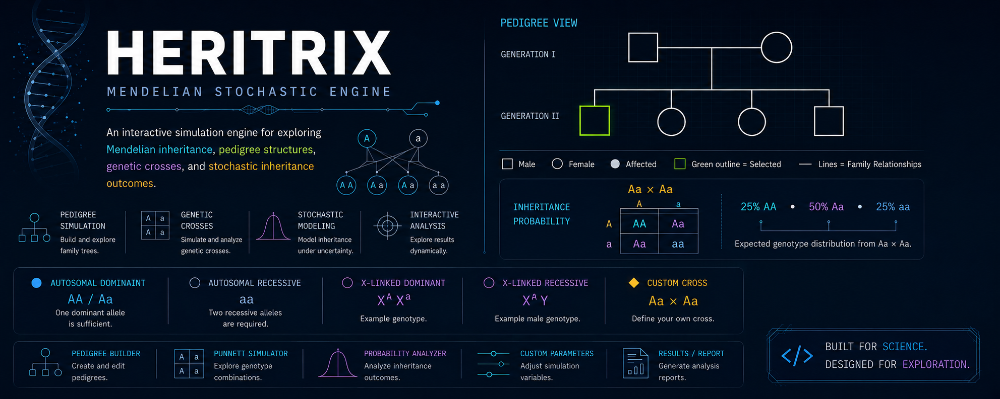

  

# 🧬 Heritrix
### Interactive Pedigree & Mendelian Simulator

**Heritrix** is an open-source simulation engine designed for genetic analysis. It enables real-time visualization of inheritance patterns, custom cross-building, and stochastic probability modeling.

---

## 🚀 Core Functionality

* **Inheritance Engines:** Support for Autosomal (Dominant/Recessive) and X-Linked (Dominant/Recessive) models.
* **Custom Cross Builder:** Define parental genotypes to simulate phenotypic outcomes.
* **Real-time Analysis:** Instant genotype/phenotype prediction and probability mapping.
* **Pedigree Architect:** Dynamic, interactive generation of multi-generational family trees.

---

## 🎓 Academic Alignment

Designed for clarity in secondary and higher education (Biology/Genetics curriculum). Ideal for demonstrating complex Mendelian principles through interactive experimentation.

---

## 📄 License

GNU General Public License v3.0 (GPL-3.0)

---

## 👨‍🔬 Author

**Draven Ashcroft**  
*M.Sc. Agricultural Entomology | ASRB–NET Qualified*

---

  <i>"Visualizing the patterns of inheritance."</i>

