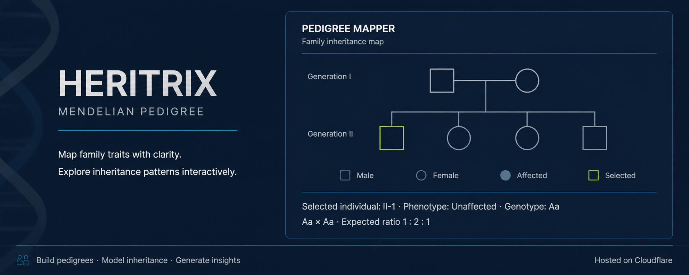

  

# 🧬 Heritrix

### *Interactive Pedigree & Mendelian Simulator*

> **Heritrix** is an interactive visualization exploring **Mendelian inheritance, pedigree analysis, genotype–phenotype relationships, and genetic probability**.
>
> 🧬 **Genetics** · 🧬 **Mendelian Inheritance** · 🌳 **Pedigree Analysis**

**🔬 [Explore the Simulation](YOUR-LINK-HERE)**

---

## ✦ Features

**🧬 Inheritance Models**  
Simulate autosomal dominant, autosomal recessive, X-linked dominant, and X-linked recessive inheritance.

**🧪 Custom Cross Builder**  
Define parental genotypes and explore predicted offspring genotypes and phenotypes.

**📊 Probability Analysis**  
Visualize genotype and phenotype probabilities from genetic crosses.

**🌳 Pedigree Architect**  
Build and explore multi-generational pedigrees for inheritance analysis.

**🔬 Genotype–Phenotype Visualization**  
Explore relationships between genetic combinations and phenotypic outcomes.

**📚 Educational Visualization**  
Supports school-level and higher-education concepts in Mendelian genetics.

---

## 🧬 Inheritance Models

**Autosomal Dominant · Autosomal Recessive · X-Linked Dominant · X-Linked Recessive**

---

## ⚙️ Technology

**HTML · CSS · JavaScript**

**Repository:** GitHub & Codeberg  
**Hosting:** Cloudflare

---

## 📜 License

Distributed under the **GNU General Public License v3.0 (GPL-3.0)**.
